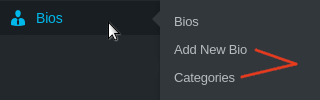
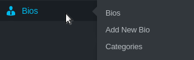
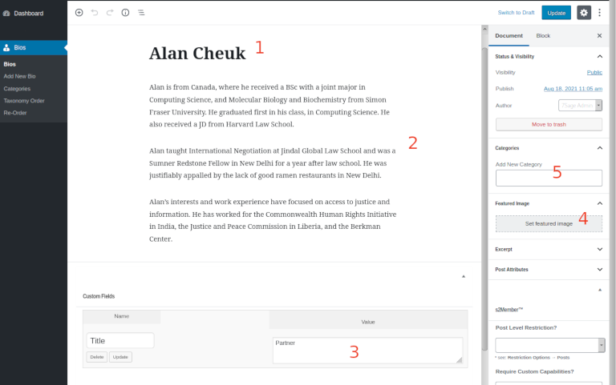
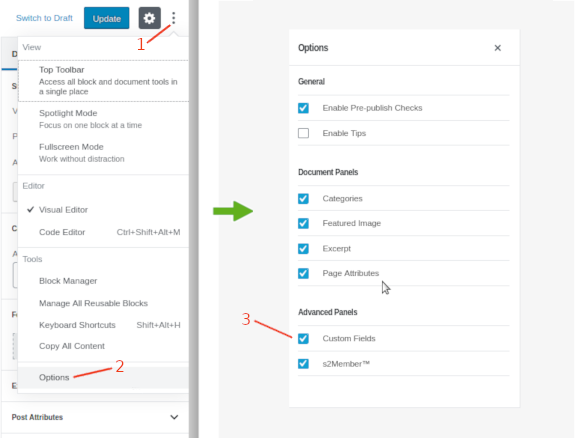
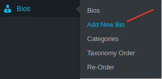
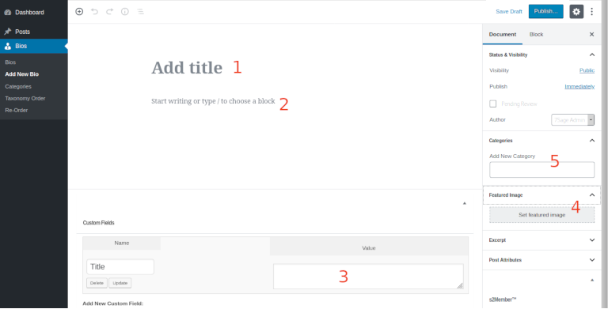
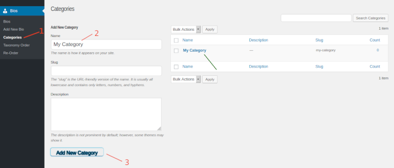
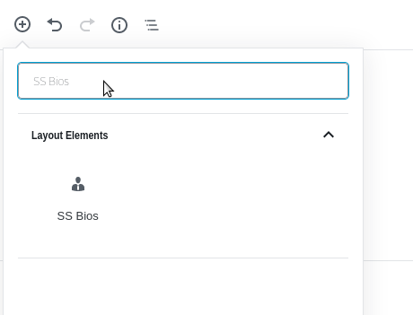
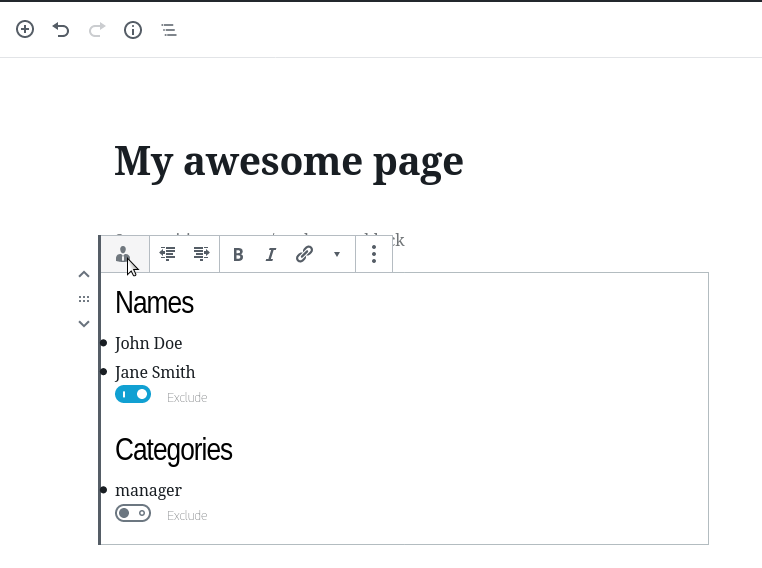

		 ____ ____    ____  _
		/ ___/ ___|  | __ )(_) ___  ___
		\___ \___ \  |  _ \| |/ _ \/ __|
		 ___) |__) | | |_) | | (_) \__ \
		|____/____/  |____/|_|\___/|___/


## Table of contents

- [Description](#description)
- [How to use](#how-to-use)
- [Managing bios](#managing-bios)
	- [Editing an existing bio](#editing-an-existing-bio)
	- [Creating a new bio](#creating-a-new-bio)
	- [Adding categories for bios](#adding-categories-for-bios)
- [How to create new bios](#how-to-create-new-bios)
- [How to create new categories](#how-to-create-new-categories)
- [How to display bios?](#how-to-display-bios)
- [Unit Testing](#unit-testing)

&nbsp;
&nbsp;

## Description
Create, read, update and delete bios

&nbsp;

## How to use?

**Installation**

To install the SS Bios plugin, clone this repository to your `wp-content/plugins/` directory or download it as a Zip archive: [https://github.com/oorkan/ss-bios/archive/refs/heads/main.zip](https://github.com/oorkan/ss-bios/archive/refs/heads/main.zip). Be sure you rename the plugin folder to `ss-bios` (don't leave it as `ss-bios-main`). Then log in to the admin panel of your website and activate the plugin.

You will need the following permissions to fully create and edit bios/categories:
`manage_categories`, `create_post`, and `*_bios`.

If you are not seeing `Add New Bio` or `Categories` in the Bios menu, please reach out to Alan for getting permissions.



&nbsp;

## Managing bios

After activating the plugin, you should be able to see a new menu item added to your admin panel sidebar:



There you'll be able to view, add, update or delete bios, as you do with regular posts. Under the same manu, you can also manage bios categories.

&nbsp;

**Editing an existing bio**
<a class="anchor" name="editing-an-existing-bio"></a>

Tap on "Bios" located in your admin panel sidebar to see all bios. Tap on the title of the bio you want to edit. This will open an editor where you can edit the

1. name
2. description
3. title ( by changing the value of a custom field called `Title` )
4. photo
5. category

of the bio.



&nbsp;&nbsp;**Note:** If you are not seeing the `Custom Fields` section below the editor, you can make it visible by following these steps:
<a class="anchor" name="make-custom-fields-visible"></a>

1. Tap on the three dots located at the top right of the page
2. At the bottom option, tap "Options"
3. Under "Advanced Panels", tick "Custom Fields"



&nbsp;

**Creating a new bio**
<a class="anchor" name="creating-a-new-bio"></a>

Tap `Add New Bio` in the `Bios` menu located in your admin panel sidebar.



This will open an editor where you can add a
1. name
2. description
3. title ( by entering a value in the custom field called `Title` )
4. photo
5. category

of the bio.



&nbsp;&nbsp;**Note:** If you are not seeing the `Custom Fields` section below the editor, follow the [steps](#make-custom-fields-visible) described in the previous section.

&nbsp;

**Adding categories for bios**
<a class="anchor" name="adding-categories-for-bios"></a>

1. Tap `Categories` in the `Bios` menu located in your admin panel sidebar.
2. Under `Add New Category`, enter the `Name` of the category. Category `Slug` and `Description` are optional.
3. Tap the `Add New Category` button located below the Description box.

When done correctly, the new category will show up in the list of categories at the right side. All categories listed can be selected when editing or creating bios.



&nbsp;

## How to display bios?

**Shortcode API**

You can display bios lists in your website using the `[ss-bio]` shortcode. `[ss-bio]`shortcode has two optional arguments: `names` and `categories`. Here are some examples:

**Ex. :** we want to grab all bios from all categories:

```php
[ss-bio]
```

**Ex. :** we want to grab John Doe's bio only:

```php
[ss-bio names='+John Doe'] or [ss-bio names='john doe+']
```

**Ex. :** we want to grab John Doe's and Jane Smith's bios only:

```php
[ss-bio names='John Doe+Jane Smith']
```

**Ex. :** we want to grab all bios but not John Doe's bio:

```php
[ss-bio names='!John Doe']
```

**Ex. :** we want to grab all bios but not John Doe's and Jane Smith's bios:

```php
[ss-bio names='!John Doe!Jane Smith']
```

**Ex. :** we want to grab all bios from the `manager` category:

```php
[ss-bio categories='manager']
```

**Ex. :** we want to grab all bios from `manager` and `consultant` categories:

```php
[ss-bio categories='manager+consultant']
```

**Ex. :** we want to grab all bios except the ones from the `manager` category:

```php
[ss-bio categories='!manager']
```

**Ex. :** we want to grab all bios except the ones from `manager` and `consultant` categories:

```php
[ss-bio categories='!manager!consultant']
```

**Ex. :** we want to grab only John Doe's bio from the `manager` category:

```php
[ss-bio names='John Doe' categories='manager']
```

**Ex. :** we want to grab only John Doe's and Jane Smith's bios from the `manager` category:

```php
[ss-bio names='John Doe+Jane Smith' categories='manager']
```

**Ex. :** we want to grab all bios from the `manager` category except John Doe's bio:

```php
[ss-bio names='!John Doe' categories='manager']
```

**Ex. :** we want to grab all bios from the `manager` category except John Doe's and Jane Smith's bios:

```php
[ss-bio names='!John Doe!Jane Smith' categories='manager']
```

&nbsp;&nbsp;**Important!**
- Supported characters for the `names` shortcode argument are: alphabetical lowercase and uppercase `(a-z and A-Z)`, spaces and periods `(.)`.
- Supported characters for the `categories` argument are: alphabetical lowercase `(a-z)` and dashes `(-)`.
- Extra spaces between "+" or "!" messes it up so please avoid using spaces between them.
- Values for the `categories` argument should represent the category slug and not the category title. Category slug should be singular and not plural.
- Mixing of inclusion and exclusion opperations isn't allowed for both `names` and `categories` shortcode arguments. Example: `[ss-bio names='John Doe+Jane Smith!Jo Black']` - this will evaluate to **FALSE**. To avoid possible confusion with inclusion and exclusion mixing, it's recommended to use `SS Bios` block in the Gutenberg block editor instead of `[ss-bio]` shortcode.
- Ideally, each bio should belong only to one category. In case if bio belongs to more than one category, be aware that, for example, `[ss-bio categories='!consultant']` will exclude bios from the `consultant` category only in case if that same bios don't belong to another category. There is no priority between categories. If, for example, John Doe's bio belongs to `consultant` and `manager` categories at the same time, and we want to exclude all `consultants` including John Doe, then we better do this: `[ss-bio categories='!consultant' names='!John Doe']`. To avoid possible confusion when a bio belongs to multiple categories, it's recommended to use `SS Bios` block in the Gutenberg block editor instead of `[ss-bio]` shortcode.

**Gutenberg API**

You can list bios on your page using the WordPress Block Editor (also known as Gutenberg Editor). To do that, add new block and search for `SS Bios`.



The logic here is the same as for the Shortcode API, except that for inclusion and exclusion operations you have more comfortable visual interface. Another benefit is that with Gutenberg you avoid possible confusions with:
- Inclusion and exclusion operations mixing
- Multicategory bios

**Ex. :** we want to grab all bios from the `manager` category except John Doe's and Jane Smith's bios, using the Gutenberg's `SS Bios` block:



&nbsp;

## Unit Testing

**1. Install PHP's mbstring module.**

Under Debian-based systems do:
```bash
sudo apt install php7.*-mbstring
```

**2. Install required components with composer.**
```bash
composer install
```

**3. Make sure  you have WP CLI installed.**

[See installation instructions here](https://make.wordpress.org/cli/handbook/guides/installing/)

**4. Allow WordPress to set up a test database for unit testing purposes, by running:**
```bash
chmod +x bin/install-wp-tests.sh
bash bin/install-wp-tests.sh <test-db-name> <test-db-user> <test-db-pass>
```

**5. Run unit tests.**
```bash
./vendor/bin/phpunit tests
```
In case of error:
- repeat the step #4
- or remove the `/tmp/wordpress` directory and repeat the step #4.

&nbsp;
&nbsp;